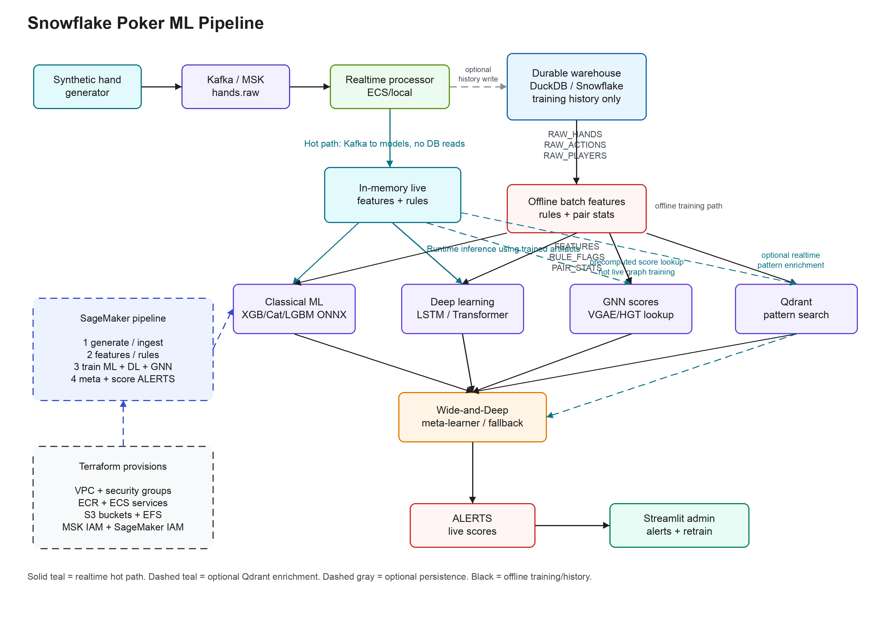

# snowflake-poker-ml-pipeline

End-to-end demo ML pipeline for detecting collusion in synthetic No-Limit Hold'em hand data. Runs locally on a laptop with DuckDB, against Snowflake with one env var, or in AWS with MSK/ECS/Qdrant/SageMaker infrastructure.

## Architecture



Planning documents:

- [Real-time context and ML implementation plan](docs/realtime-context-ml-implementation-plan.md)
- [Data generation, storage, and pipeline plan](docs/data-generation-and-pipeline-plan.md)
- [100-table test data, alert, and dataset plan](docs/100-table-test-data-and-alert-plan.md)
- [PostgreSQL/Debezium hand-history ingress contract](docs/debezium-hand-history-ingress.md)
- [C2 simulation adapter Docker/SPCS packaging](docs/spcs-c2-adapter-simulation.md)
- [How the Flink real-time feature pipeline works](docs/flink-realtime-feature-pipeline.md)
- [Data science and ML/AI model development guide](docs/data-science-model-development-guide.md)
- [ML/AI recommendations implementation plan](docs/ml-ai-recommendations-implementation-plan.md)
- [SPCS service rationalization and refactoring plan](docs/spcs-service-rationalization-plan.md)
- [Active-user context and Flink architectural refactoring plan](docs/active-user-context-refactoring-plan.md)
- [Rules v2 governance, evaluation, monitoring, and rollback](docs/rule-governance-evaluation.md)
- [Rules v2 monitoring and alerting](docs/rule-monitoring-and-alerting.md)
- [Realtime model input contract](docs/realtime-model-input-contract.md)

## What's in here

- **PokerKit hand generator** — valid 4–6 player NLHE cash-game state transitions with deterministic cards, real pot settlement, and injected synthetic collusion patterns.
- **Kafka stream** — hands published to `hands.raw`; consumer batches them into the warehouse.
- **Warehouse** — Snowflake or DuckDB (toggle with `WAREHOUSE_BACKEND`). Same SQL migrations run on both.
- **Feature engineering** — ~60 numeric features per `(hand_id, player_id)` from raw actions.
- **Rule engine** — 5 simple Python rules ported from the original Rust engine.
- **Classical ML** — XGBoost, CatBoost, LightGBM with frozen leakage-safe splits and ONNX export.
- **Deep learning (phase two)** — LSTM encoder + Transformer encoder over action sequences.
- **GNN (phase two)** — VGAE + simple HGT over the player-pair graph.
- **Qdrant** — similarity search over pair-pattern embeddings.
- **Wide-and-Deep meta-learner** — small PyTorch stacker that fuses all model outputs into a final risk score.
- **Realtime processor** — Kafka hot path that computes features/rules in memory, scores with trained artifacts, and optionally persists history/alerts.
- **Java/Flink hot path** — event-time context enrichment, prior-only user and pair state, six-player-to-15-pair expansion, and versioned feature snapshots on canonical Kafka topics. Older PyFlink motif jobs remain available as local experiments.
- **Streamlit admin** — alerts, hand viewer, model metrics, graph explorer, retrain trigger, similarity search.
- **AWS deployment** — Terraform for VPC, ECR, S3, ECS/Fargate, optional MSK/Qdrant, and a SageMaker training pipeline.
- **Snowflake container deployment** — CPU services/jobs on Snowpark Container Services with internal model stages and managed-Kafka egress.

## Quickstart (local, no Snowflake account)

```bash
cp .env.example .env       # ships with WAREHOUSE_BACKEND=duckdb
make install
make demo                  # services + migrate + generate + consume + features + train + seed-qdrant
make admin                 # streamlit at http://localhost:8501
```

## Reproducible CPU validation

The validation workflow is intentionally different from an unbounded random
stream. PokerKit first creates four frozen datasets. Train, validation, test,
and challenge each have a separate player population, so player or collusion
pair identity cannot leak across evaluation boundaries. Ground-truth labels
are stored in sidecar files and are absent from the Kafka events used for
inference.

```bash
# Recommended comparison dataset: 20k / 5k / 5k / 5k hands.
make dataset

# Load only labeled train/validation/test data and build warehouse features.
make load-dataset

# CPU phase: XGBoost + CatBoost + LightGBM, ONNX export, then batch scoring.
make train

# Fast local smoke variant while developing.
make cpu-validate TRAIN_HANDS=1000 VALIDATION_HANDS=300 \
  TEST_HANDS=300 CHALLENGE_HANDS=300
```

The challenge set stays out of training. After models are frozen and the
realtime consumer is running, replay the exact same label-free events through
Kafka and compare persisted alerts with the local label sidecar:

```bash
make replay-challenge REPLAY_RATE=25
make evaluate-challenge
```

`manifest.json` records seeds, counts, PokerKit version, and SHA-256 hashes for
every event and label file. Rebuilding with the same configuration produces
identical data.

The next-generation context-rich dataset adds versioned event envelopes,
synthetic users, devices, networks, sessions, account links, and private
pair-level labels while retaining legal PokerKit hands:

```bash
# Small first milestone; generated files remain outside Git.
make world-dataset TRAIN_HANDS=20 VALIDATION_HANDS=5 \
  TEST_HANDS=5 CHALLENGE_HANDS=5 DATASET_PLAYERS=24 DATASET_PAIRS=4
```

This writes separate topic-ready JSONL streams under
`data/datasets/context-v1/<split>/events/`. Challenge labels are written only
under `private_labels/`. Direct Kafka replay is the current project path. The
future Debezium boundary and source-independent Go runtime are offline-verifiable
with `make phase-c2-runtime-check`; this does not deploy a connector or service.

The new structural multi-table smoke schedules 100 concurrent tables, 530
seats, and users playing up to five tables. It includes scheduled multi-hand
positive cases, difficult negatives, three-account rings, and private scenario
sidecars. Inference-safe context snapshots materialize household and
shared-network negative cases without exposing scenario identity.

```bash
make multitable-data-test
make multitable-data-smoke
```

The default smoke writes 3,000 train hands plus 1,000 hands in each of
validation, test, and challenge under `data/datasets/multitable-cold-v1/`.

Build the D5 benchmark assignment layer only after that immutable source world
exists:

```bash
make multitable-benchmarks-test
make multitable-benchmarks
make multitable-benchmarks-check
```

The output under `data/datasets/multitable-benchmarks-v1/` contains four
label-free hand-assignment products: source-population cold start, chronological
70/15/15 temporal, protected new relationship, and sealed challenge. It does
not copy events, features, labels, or private labels. Its machine-readable
audit checks complete hand coverage, player/pair/group separation, strict time
boundaries, protected relationship isolation, train-only preprocessing policy,
validation-only threshold policy, hashes, and challenge isolation. The builder
intentionally does not open the source challenge label directory.

Build the D6 pack and run bounded runtime parity:

```bash
make multitable-alert-acceptance-test
make multitable-alert-acceptance
make multitable-alert-acceptance-check
make multitable-alert-replay-java

# With the DGX tunnel running on localhost:18000:
make multitable-alert-replay-local
```

This creates a separate 16-hand PokerKit replay pack with 240 complete
six-player pair snapshots, precise rule-positive and must-not-fire assertions,
frozen model/policy hashes, 14 expected model alerts, and exactly ten selected
demo alerts. Score, decision, alert, sink, and admin identities are sealed in a
private post-score oracle. The dataset manifest sets `training_allowed=false`,
and both the pair-dataset builder and CatBoost trainer reject it before writing
output. The pack also contains 96 inference-safe player-context rows for
bounded Java replay. `multitable-alert-replay-java` executes the feature and
stateful-rule business logic shared with the Flink operators and compares all
240 rows. `multitable-alert-replay-local` additionally scores all 16 hands
through the Go service and a real Triton V2 endpoint, opening the private
oracle only after scoring. Its run report keeps Kafka/SPCS, Snowflake sinks,
and admin status as `not_run`; those deployment checks belong to D7.

Validate the complete replay locally, create any missing canonical topics, then
publish and read a bounded split back from Kafka:

```bash
make world-replay-dry
make world-topics

python scripts/replay_world.py --dataset data/datasets/context-v1 \
  --mode replay --split train
python scripts/verify_world_replay.py --dataset data/datasets/context-v1 \
  --split train --timeout-ms 20000
```

Available delivery modes are `replay`, `accelerated`, `realtime`, and `chaos`.
The Kafka record timestamp is the current publish time so historical replays do
not immediately expire from delete-policy topics. Business event time remains
unchanged in the envelope's `occurred_at` field and Kafka header.

Load canonical envelopes into the configured DuckDB or Snowflake warehouse.
The production consumer commits Kafka offsets only after the warehouse
transaction succeeds; the manual-assignment form is useful for a bounded audit:

```bash
# Long-running consumer-group mode.
make world-ingest WORLD_INGEST_FLAGS="--group-id poker-world-warehouse-sink-v1"

# Re-read a known frozen smoke dataset without changing consumer-group offsets.
python scripts/ingest_world.py --migrate --assign-from-beginning \
  --max-messages 70 --batch-size 200
python scripts/check_world_warehouse.py
```

World-generated player, pair, table, and hand IDs include `dataset_id`, so a
new benchmark cannot replace rows belonging to an older frozen dataset.

## Frozen pair benchmarks

Build the pair-level ML data product from the immutable context world—not from
current Kafka or current user rows:

```bash
make pair-dataset
make pair-dataset-check
```

`data/datasets/pair-v1` contains four benchmark views:

- `cold_start`: the original disjoint-user train/validation/test/challenge splits.
- `temporal`: one user population split chronologically 70/15/15.
- `new_relationship`: hand-atomic splits that keep validation/test positive
  pair identities out of training.
- `challenge`: public feature rows with labels only under `private_labels/`.

Every public feature file is label-free. The `dgx/` directory contains
train/validation/test Parquet files with a binary `target`, the exact
`pair-features-v1` model columns, and no challenge rows. `manifest.json` records
all counts, SHA-256 hashes, split policies, and the source-world hash.

Migration 009 adds the restricted `PAIR_LABELS` table and the point-in-time
`PAIR_TRAINING_EXAMPLES` view. Load non-challenge label sidecars only after the
feature events are persisted:

```bash
make pair-labels PAIR_LABEL_FLAGS=--migrate
```

## Pair-level CatBoost baseline

Phase 8 trains only from the frozen Parquet contract. Numeric imputation and
categorical vocabularies are fitted on `train`; Platt calibration and the
alert-budget threshold are fitted on `validation`; `test` and the private
challenge sidecar are evaluated afterward. The trainer also compares a
deterministic rules baseline and a player-only logistic baseline:

```bash
make pair-train
make pair-model-check
```

Artifacts under `models/pair-catboost-v1/` include the native CatBoost model,
a tensor-output ONNX model, train-fitted preprocessing, calibration and
decision-policy JSON, test/challenge reports, feature importance, SHAP summary,
artifact hashes, and a ready-to-mount Triton model repository. ONNX is checked
against CatBoost probabilities and the checker scores complete 15-pair hands
without reading labels.

The current 20/5/5/5-hand `pair-v1` dataset is intentionally only a pipeline smoke test:
it has 2/1/0 positive pair rows in train/validation/test, so the generated model
is marked `promotion_eligible=false`. Build a separate full dataset before
using performance numbers:

```bash
make world-dataset WORLD_DATASET_DIR=data/datasets/context-full-v2 \
  WORLD_DATASET_ID=context-full-v2 TRAIN_HANDS=20000 VALIDATION_HANDS=5000 \
  TEST_HANDS=5000 CHALLENGE_HANDS=5000
make pair-dataset WORLD_DATASET_DIR=data/datasets/context-full-v2 \
  PAIR_DATASET_DIR=data/datasets/pair-full-v2
make pair-train PAIR_DATASET_DIR=data/datasets/pair-full-v2 \
  PAIR_MODEL_DIR=models/pair-catboost-full-v2
```

`context-full-v2` gives synthetic colluding relationships imperfect, correlated
context such as shared infrastructure, similar account age, and similar skill.
The correlations are probabilistic, normal users also share context, and no
pair ID or target appears in inference events. This avoids a deterministic
synthetic label leak while giving the cold-start benchmark a relationship
signal that can generalize to disjoint users.

The frozen full-v2 run passed the promotion gate: test PR-AUC 0.363 versus
0.239 for the player-only baseline and 0.040 for rules-only, with 70.7% recall
at the 2% alert-ranking budget. Private challenge PR-AUC was 0.375 with 83.0%
recall at budget. These are synthetic benchmark results, not production claims.

## Go risk scorer

The Go hot path validates the promoted artifact hashes and exact 58-feature
contract, keeps a bounded correction-aware hand cache, and sends one Triton V2
request for all 15 pairs. Calibration, thresholding, player aggregation, and
hand aggregation use the frozen JSON policies produced during training:

```bash
make go-risk-test
make go-risk-check

# Start after mounting models/pair-catboost-full-v2/triton in Triton.
make go-risk-run TRITON_HTTP_URL=http://127.0.0.1:8000
```

The service exposes `/healthz`, Triton-backed `/readyz`, Prometheus `/metrics`,
complete-hand `/v1/score-hand`, and incremental `/v1/pair-feature` endpoints.
Higher snapshot revisions re-score a cached complete hand; duplicates and stale
revisions do not call the model. The Go Kafka adapter now consumes
`poker.pair-features.v1`, publishes versioned rule evidence, risk scores,
independent `poker.review-decisions.v1` audit events, and policy-linked alerts.
It dead-letters invalid records and commits only contiguous offsets whose
outputs have been acknowledged. Run it after Triton:

```bash
make scoring-topics
make go-risk-kafka TRITON_HTTP_URL=http://127.0.0.1:8000
```

Because pair features are currently keyed by `pair_key`, the initial scorer
deployment is intentionally one replica. A hand-keyed repartition is required
before horizontal scaling.

The promoted model has also been smoke-tested on DGX Spark through a
localhost-only SSH tunnel. See the
[DGX Triton scoring runbook](docs/dgx-triton-scoring-runbook.md) for repeatable
deployment, readiness, bounded Kafka replay, and output-validation commands.

## DGX Spark deep-learning validation

DL training uses the same frozen train/validation/test boundaries as the
classical models. The amount normalization scale is fitted on training actions
only, validation chooses the classification threshold and early-stopping
checkpoint, and test is used once for the final ROC-AUC, PR-AUC, and F1 report.
Challenge and live rows are excluded.

Export a secret-free NumPy bundle from the configured warehouse, then copy the
bundle and source code to DGX Spark. Snowflake credentials and `.env` are never
copied:

```bash
make dl-export
make dgx-train-dl
make dgx-fetch-dl
```

The DGX target uses NVIDIA's PyTorch container with GPU access, host IPC, and
the recommended memory/stack limits. Docker only supplies the runtime; the
repository and generated artifacts are bind-mounted, so container overhead is
negligible. Useful overrides include:

```bash
make dgx-train-dl DGX_EPOCHS=30 DGX_BATCH_SIZE=1024 DGX_PATIENCE=5
make dgx-train-dl DGX_HOST=IcardiSpark DGX_IMAGE=nvcr.io/nvidia/pytorch:25.12-py3
```

The resulting `models/dgx/dl_metrics.json` records validation and untouched
test metrics for both LSTM and Transformer models. Compare test PR-AUC and F1
against the frozen CatBoost baseline before promoting either model.

### Phase 9 pair challengers

The frozen `pair-full-v2` cold-start dataset has also been used to train a
Residual MLP, FT-Transformer, and DCN-V2 on DGX Spark. The workflow keeps the
private challenge off DGX, fits preprocessing on train only, selects checkpoints
and thresholds on validation, and uses a paired hand bootstrap for the CatBoost
comparison:

```bash
make pair-challengers-test
make dgx-pair-challengers-train
make dgx-pair-challengers-fetch
make pair-challengers-check
```

The completed run passed its artifact and leakage checks, but none of the neural
models passed the quality gate. The best neural test PR-AUC was `0.186673`,
versus `0.362918` for CatBoost, so CatBoost remains the champion and the private
challenge stays sealed. See the
[DGX pair-challenger runbook](docs/dgx-pair-challengers-runbook.md) for the full
metrics, promotion policy, and reproducible commands.

### Phase 10 multi-hand histories

Phase 10 builds 16-hand, strictly point-in-time histories for both users and
their pair. Equal-timestamp hands are isolated, normalization is fitted on train
only, and self-supervised user/pair encoders learn masked-step reconstruction,
next-step prediction, and contrastive window consistency before pair-risk
fine-tuning:

```bash
make pair-history-dataset
make pair-history-dataset-check
make dgx-pair-history-train
make dgx-pair-history-fetch
make pair-history-check
```

The full 450,000-row history artifact passed its hash, alignment, timestamp,
and label-isolation checks. The DGX model achieved test PR-AUC `0.181929`
versus `0.362918` for CatBoost, so it was correctly rejected and the private
challenge remains sealed. See the
[DGX multi-hand history runbook](docs/dgx-pair-history-runbook.md) for the data
contract, measured results, and repeatable commands.

### Phase 11 temporal heterogeneous graph

Phase 11 constructs prior-only typed neighborhoods for users, devices,
networks, sessions, tables, account-link evidence, and co-player relationships.
The relation-aware GraphSAGE model uses feature-derived node initialization and
contains zero raw-ID embeddings, allowing cold-start inference for unseen users:

```bash
make pair-graph-baseline
make pair-graph-dataset
make pair-graph-dataset-check
make dgx-pair-graph-train
make dgx-pair-graph-fetch
make pair-graph-check
```

The 750,000-example cold-start/new-relationship graph artifact passed source,
hash, alignment, future-edge, challenge-isolation, and inductive-node checks.
GraphSAGE reached PR-AUC `0.247934` on cold start and `0.508470` on new
relationships, compared with matching CatBoost results of `0.362918` and
`0.615757`. Both bootstrap intervals were negative, so CatBoost remains the
champion. See the
[DGX temporal graph runbook](docs/dgx-pair-graph-runbook.md) for exact metrics
and reproducible commands.

## Real-time processing

`make demo` runs the batch demo path: generate Kafka data, persist it, then compute features/train/score from the warehouse. For live processing, use the realtime targets instead.

Training reads historical data from the configured warehouse (`duckdb` locally or Snowflake in cloud mode). Live hands are processed directly by the realtime pipeline from Kafka and model artifacts; the warehouse is only used afterward for optional history/admin/training persistence:

```bash
make demo                  # builds warehouse history and model artifacts once
make realtime              # terminal 1: Kafka -> in-memory ML/DL scoring -> ALERTS
make generate              # terminal 2: publish new live hands
```

For a one-command live smoke run:

```bash
make demo-realtime
```

By default, `demo-realtime` does not write to the warehouse. To keep realtime
history/alerts for later training or admin inspection, run migrations first and
drop the no-persist flags:

```bash
make migrate
make demo-realtime REALTIME_FLAGS=--from-beginning
```

`scripts/realtime.py` computes features/rules from each Kafka batch in memory, runs available model artifacts, generates alerts, and then optionally stores raw/features/rules/alerts for durability. In the CPU phase this means classical ONNX models plus rules; DL/GNN artifacts are added only in phase two. Use `--batch-size` for latency/throughput, `--no-persist-history` to avoid warehouse history writes, and `--no-persist-alerts` to avoid alert table writes.

Qdrant pattern search can be added to realtime as a bounded, fail-open
enrichment:

```bash
python scripts/realtime.py --enable-pattern-search
```

When enabled, realtime only queries candidate pairs from hands that already have
rule signals or preliminary high-risk scores. Qdrant failures or missing
collections are logged and skipped so the hot path can still generate alerts.

## Flink hot path

The context-rich path now has a native Java/Flink event-time job in addition
to the earlier PyFlink demo jobs. It joins every hand/player row to the user
context version effective when the hand occurred, publishes explicit
matched/late/missing/corrected status, and performs no synchronous database
lookups:

```bash
make enrichment-topics
make flink-context-test
make flink-context-build
make flink-pair-features-test
make flink-pair-features-build
```

See the
[context-enrichment runbook](streaming/flink-java/context-enrichment/README.md)
for Flink submission and bounded replay-audit commands. The canonical output
is `poker.hand-player-context.v1`; invalid envelopes and context-version
conflicts go to `poker.pipeline.dead-letter.v1`.

The next native stage consumes those enriched player rows, keeps prior-only
user and pair history in keyed state, reassembles each hand, and emits all 15
canonical pairs to `poker.pair-features.v1`. Context corrections re-emit only
the affected five pairs and do not count the hand twice. Contract floats are
rounded to nine decimal places so Java/Flink and Python/Snowflake backfills are
byte-stable at the feature boundary. See the
[pair-feature runbook](streaming/flink-java/pair-features/README.md).

Validate a bounded replay and persist it after the Flink job exits:

```bash
make pair-features-check PAIR_FEATURE_CHECK_FLAGS="--input-topic poker.hand-player-context.v1 --minimum-records 300"
make pair-features-ingest PAIR_FEATURE_INGEST_FLAGS="--migrate --from-beginning --max-messages 300"
```

When Snowflake human-user MFA has expired, run `make snow-mfa-login` immediately
before the ingest command. The sink commits Kafka offsets only after its
warehouse transaction and upserts by deterministic `event_id`.

The older jobs below continue to serve the original `hands.raw` demo path.

The Flink implementation is the production-oriented replacement for the direct
Python Kafka loop. It consumes complete hand events from `hands.raw`, reuses the
same in-memory feature/rule/model scoring path, maintains rolling player-pair
memory, detects short action motifs for candidate pair review, optionally
enriches candidates with Qdrant pattern search, and publishes alert JSON records
to `alerts.out`.

```bash
make install-flink         # optional PyFlink runtime
make services              # Kafka + Qdrant
make demo                  # build historical warehouse + model artifacts once
make flink-realtime        # terminal 1: Flink/PyFlink Kafka -> alerts.out
make generate              # terminal 2: publish new live hands
```

For checkpointable pair memory, run the keyed-state job beside the alert scorer:

```bash
make flink-pair-memory FLINK_PAIR_MEMORY_FLAGS=--from-beginning
make flink-realtime FLINK_FLAGS="--use-pair-memory-topic --enable-pattern-search"
```

This reads `hands.raw`, expands each hand into player-pair updates, keys by
`player_a|player_b`, stores rolling pair state in Flink state, and publishes
feature snapshots to `pair.memory`. When `flink-realtime` runs with
`--use-pair-memory-topic`, it keeps that topic in broadcast state and uses the
latest pair-memory rows for Qdrant candidate gating.

For action-level candidate motifs, run the action-pattern job:

```bash
make flink-action-patterns FLINK_ACTION_PATTERN_FLAGS=--from-beginning
```

This reads `hands.raw`, expands each complete hand into normalized action
events, detects patterns such as preflop squeeze, raise/fold benefit,
call-down transfer, and passive soft-play chains, then publishes pair-level
signals to `patterns.action`. This is a low-latency candidate stream for the
next scorer/Qdrant enrichment pass; the current alert scorer still reads
complete hands plus optional `pair.memory`.

Useful knobs:

```bash
make flink-realtime FLINK_FLAGS="--from-beginning --threshold 0.25"
make flink-realtime FLINK_FLAGS="--enable-pattern-search"
make flink-realtime FLINK_FLAGS="--enable-pattern-search --pattern-candidate-pair-memory-score 0.55"
make flink-action-patterns FLINK_ACTION_PATTERN_FLAGS="--max-gap 4 --min-call-amount-bb 3.0"
```

If your PyFlink runtime does not bundle the Kafka connector, download the
matching Flink Kafka connector JAR and pass it with
`--kafka-connector-jar` or `FLINK_KAFKA_CONNECTOR_JAR`.

On machines where the default Python is newer than PyFlink's dependency stack,
pin the worker executable so the client and Flink workers use the same runtime:

```bash
PYFLINK_PYTHON=/path/to/python3.10 make flink-action-patterns \
  FLINK_ACTION_PATTERN_FLAGS="--python-executable /path/to/python3.10 --from-beginning"
```

This Flink slice still uses complete hand events as the source of truth. The
alert scorer can either keep operator-local pair memory for simple local demos
or consume `pair.memory` as a broadcast enrichment stream for checkpointed pair
features. The action-pattern job derives action-level candidate events from the
same hand stream and publishes them separately to `patterns.action`.

## Switching to Snowflake

```bash
# Edit .env:
#   WAREHOUSE_BACKEND=snowflake
#   SNOWFLAKE_ACCOUNT=...
#   SNOWFLAKE_USER=...
#   SNOWFLAKE_PASSWORD=...
#   SNOWFLAKE_WAREHOUSE=DEMO_WH
#   SNOWFLAKE_DATABASE=POKER_ML_DEMO
make migrate
make demo
```

No code changes. Same Python modules, same Streamlit admin, same ONNX artifacts.

Run `make train-full` only after moving to a Snowflake region with a supported
GPU pool and building the GPU runtime image. The default `make train` and
`make snow-train` commands deliberately remain CPU-only.

### Snowpark Container Services deployment

The Snowflake-native container path runs the Streamlit admin, realtime scorer,
and CPU training job from one `linux/amd64` image in Snowflake's image registry.
Because public SPCS endpoints are HTTP/HTTPS, the laptop producer and the
Snowflake consumer use an external managed Kafka cluster rather than exposing a
Kafka TCP broker from Snowflake.

See [infra/snowflake/README.md](infra/snowflake/README.md) for provisioning,
registry push, Kafka secret/egress setup, deployment, status, and cost-control
commands.

The separate production-shaped Go and Java/Flink services, runtime model
bundle, durable state, release guard, and validation sequence are documented in
[Phase C1: Go and Flink deployment on SPCS](docs/spcs-c1-deployment.md).

## AWS / SageMaker architecture

Terraform under `infra/terraform` provisions the cloud demo stack:

- VPC, security groups, ECR, S3 buckets, CloudWatch logs, and IAM roles.
- Optional MSK Serverless for the `hands.raw` stream.
- Optional ECS/Fargate services for the Streamlit admin, stream consumer, and Qdrant with EFS storage.
- A SageMaker Pipeline assembled by `infra/sagemaker_pipeline.py`.

The SageMaker pipeline uses the BYOC GPU image for every stage and runs:

```text
generate -> ingest -> features/rules/pair stats
              -> XGBoost + CatBoost + LightGBM + DL + GNN
              -> Wide-and-Deep meta-learner
              -> batch score -> ALERTS
```

The cloud path defaults to DuckDB backed by S3 parquet (`DUCKDB_S3_BUCKET` / `DUCKDB_S3_PREFIX`) so the same warehouse adapter is used locally, on ECS, and in SageMaker. Snowflake remains available by setting `WAREHOUSE_BACKEND=snowflake`.

Useful targets:

```bash
make tf-init
make tf-plan
make tf-apply
make build-byoc
make push-byoc
```

## Project layout

```
pipeline/                  # Library code (pip install -e .)
  warehouse/               # Snowflake + DuckDB adapters
  generator/               # PokerKit simulation, frozen data + collusion injection
  kafka/                   # Producer + consumer
  features/                # Feature engineering
  rules/                   # Rule engine (5 rules)
  realtime/                # Kafka hot path: in-memory features/rules/scoring
  flink/                   # PyFlink hot path entrypoint
  context/                 # Offline/reference point-in-time context join
  events/                  # Canonical input and derived Pydantic contracts
  ml/                      # XGBoost / CatBoost / LightGBM + ONNX
  dl/                      # LSTM + Transformer
  gnn/                     # VGAE + simple HGT
  qdrant/                  # Embedding + pattern store
  meta/                    # Wide-and-Deep meta-learner
  inference/               # Ensemble scorer
  sm/                      # SageMaker entrypoints
admin/                     # Streamlit multipage app
streaming/flink-java/      # Native stateful Flink jobs (Java 17)
sql/migrations/            # Versioned DDL (Snowflake; DuckDB-translated automatically)
scripts/                   # CLI entrypoints
infra/                     # Terraform + SageMaker pipeline definition
tests/                     # pytest smoke tests
```

## Data flow

Batch/offline demo path:

```
generator
    │
    ▼
Kafka topic `hands.raw`
    │
    ▼
stream consumer ──► RAW_HANDS / RAW_ACTIONS / RAW_PLAYERS
    │
    ▼
feature engineering + rules + pair stats
    │
    ▼
FEATURES + RULE_FLAGS + PAIR_STATS
    │
    ├──► XGB / CatBoost / LightGBM ONNX
    ├──► LSTM / Transformer
    └──► VGAE / HGT graph scores
           │
           ▼
Wide-and-Deep meta-learner
           │
           ▼
batch inference -> ALERTS -> Streamlit admin
```

Realtime hot path:

```
Kafka topic `hands.raw`
    │
    ▼
PyFlink job or scripts/realtime.py fallback
    │
    ├──► in-memory features + rule flags
    ├──► rolling pair memory (`pair.memory` with Flink keyed state)
    ├──► action motifs (`patterns.action`)
    ├──► trained ML/DL artifacts + GNN score lookup
    └──► optional Qdrant pattern enrichment
           │
           ▼
live ALERTS
           │
           ├──► optional warehouse persistence for admin/history/training
           └──► Streamlit admin
```

## License

Demo / educational use. No production data is included.
